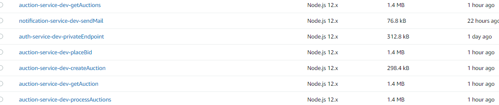
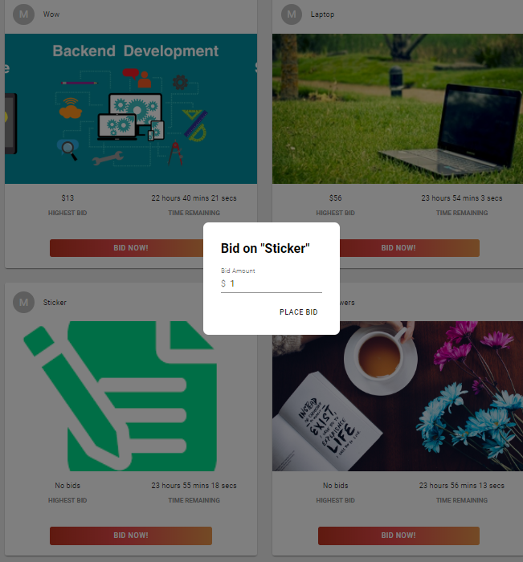

## Click to see the live app:  [Serverless-Auction-Site](fervent-tereshkova-4c9adc.netlify.app)

# Serverless-Auction-Site  Microservices Focused 

## About 
A serverless auction site where you post your products people can bid on it and the highest bidders takes all

I Had my first taste of microservice-architecture 

Abstracted the Notification service and Authentication service from the main Auction Services

## It utilizes
---- AWS Eventbridge --- AWS Dynamodb ---- AWS s3 auctions bucket ------ AWS SQS and SES
#### AWS API GATEWAY 
    To create restful APIS
#### AWS Dynamodb 

     To Store Information and Ensure Data Persistence 
#### AWS s3 Bucket
     To enable and store image upload
 
#### AWS SQS and SES
    Email notification 

## Lambda Functions
 The server implementation supports GET, POST and PATCH
 
#### GET Request - Gets all Auctions 

    GET /auctions?status=CLOSED
#### GET Request - Gets Auction by Id 

    GET /auction/{id}

#### PATCH Request - Place bid on Auction by Id 

    PATCH /auction/{id}/bid
#### PATCH Request - Upload Auction Image by Id 

    PATCH /auction/{id}/picture

#### POST Request - creates a new auction

    POST /auction

POST Body

    {"title":"used Iphone"}

## FrontEnd 
Template from the Stoic Programmer 

## App Info

### Author
Ibironke Marvellous
